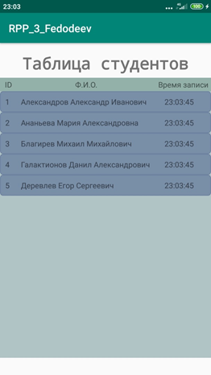
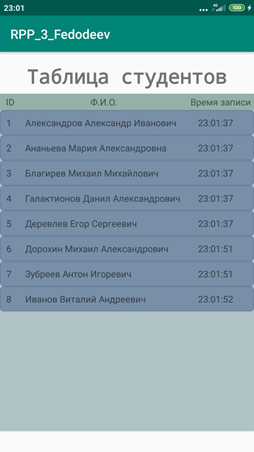
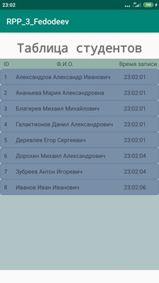

# RPP_3
В данной лабораторной работе требуется реализовать базу данных студентов.

Для работы со списком студентов была использована база данных SQLite. В программе присутствуют 4 класса, два из которых отвечают за отображение данных на активити, а два других работают с данными самой БД. На первой активити изображены три кнопки. Первая кнопка добавляет запись в таблицу с помощью функции, которая записывает текущее ФИО студента из текстового файла через ContentValues. Вторая кнопка заменяет последнее ФИО в списке на ФИО по умолчанию с помощью подстановки значения поля из отдельного класса DBData, отвечающего за функции языка SQLite. Третья кнопка открывает второе активти, содержащее данные БД в виде RecyclerView, состоящего из 3 списков: ID, ФИО и время добавления. 

# Скриншоты программы

Первое активити

Второе активти по умолчанию

Второе активти с добавленными записями

Второе активити с измененной записью по умолчанию

